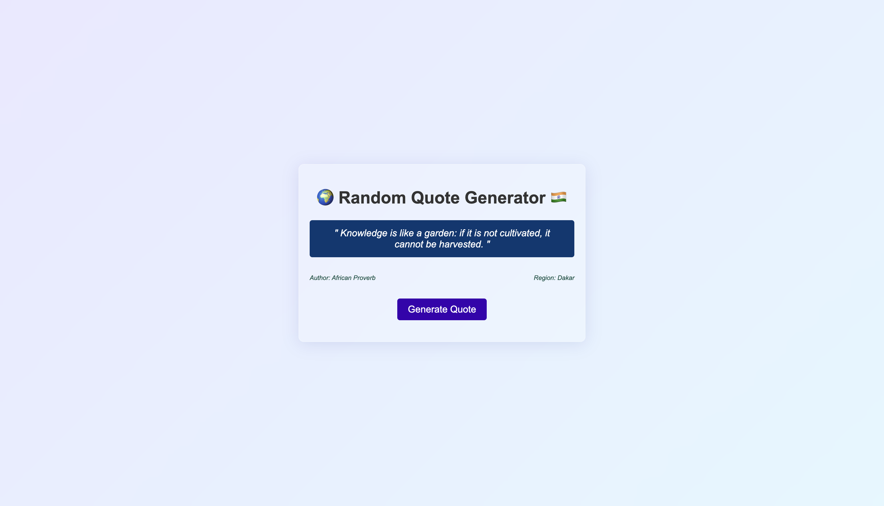

# 🌍 Random Quote Generator 🇮🇳

A simple and visually appealing Random Quote Generator that displays inspirational quotes from African and Indian cultures. The app features a modern glassmorphism design and allows users to generate random quotes with the click of a button.

---

## 🚀 Features

- Displays random quotes with the author and region.
- Includes a sleek **glassmorphism** design for the UI.
- Responsive and user-friendly interface.
- Quotes are sourced from African and Indian proverbs.
- Dynamically updates the quote, author, and region on button click.

---

## 🛠️ Technologies Used

- **HTML**: Structure of the application.
- **CSS**: Styling with a focus on glassmorphism design.
- **JavaScript**: Logic for generating and displaying random quotes.

---

## 📖 How to Use

1. Clone this repository to your local machine:
   ```bash
   git clone https://github.com/wakassodev/quote_generator.git
   ```

2. Navigate to the project directory:
   ```bash
   cd random-quote-generator
   ```

3. Open the `index.html` file in your browser to view the app.

4. Click the **"Generate Quote"** button to display a random quote.

---

## 📂 Project Structure

```
Random Quote Generator/
├── index.html       # Main HTML file
├── style.css        # CSS file for styling
├── index.js         # JavaScript file for functionality
├── quote_data.js    # Contains the quotes array
├── quote_sample.png # Screenshot of the app
└── README.md        # Project documentation
```

---

## 🎨 Glassmorphism Design

The app uses a modern **glassmorphism** design for the quote container and background. This includes:
- Semi-transparent backgrounds.
- Blur effects for a frosted glass look.
- Subtle shadows and rounded corners.

---

## 📷 Screenshots

### Main Interface


---

## 🤝 Contributing

Contributions are welcome! If you'd like to improve this project, feel free to fork the repository and submit a pull request.

---

## 📜 License

This project is licensed under the [MIT License](LICENSE).

---

## ✨ Acknowledgments

- Quotes sourced from African and Indian proverbs.
- Inspired by the beauty of cultural wisdom and modern UI design.
